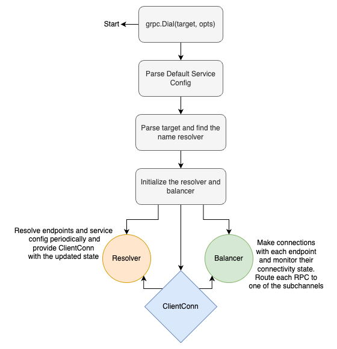

# gRPC Name Resolution and Load Balancing on Kubernetes

This project aims to picture things that were described in my blog post:

[gRPC Name Resolution & Load Balancing on Kubernetes: Everything you need to know (and probably a bit more)](https://itnext.io/grpc-name-resolution-load-balancing-everything-you-need-to-know-and-probably-a-bit-more-77fc0ae9cd6c)



## Intructions:
1. Install a local Kind cluster named `kind` and a namespace called `test`. Then add a context to your Kubernetes config file with this cluster and namespace and name the cluster `kind-kind-test`
    
    https://kind.sigs.k8s.io/docs/user/quick-start/    

2. Use commands in the root [Makefile](./Makefile) in order to build (and probably push) the Docker images for `http` and `gRPC` services.
    If you wanted to push the images to a registry as well, make sure to export `PUSH=1` and change the registry names in respecitve Makefiles from mine to yours ([http Makefile](./http/Makefile), [gRPC Makefile](./grpc/Makefile))

    ```bash
    export PUSH=1 # if you want to push them to a registry as well
    make both-http
    make both-grpc
    ```
3. Follow the instructions to setup LinkerD on your machine:

    https://linkerd.io/2.14/getting-started/

4. Apply the k8s files to your local cluster ([http k8s files](./http/k8s/), [gRPC k8s files](./grpc/k8s/)) :
    ```bash
    kubectl apply -f -R k8s/
    ```

5. You can use tools like `stern` in order to observe logs from different pods simultaniously

    https://github.com/stern/stern

    ```bash
    # in shell number 1
    stern post-api
    # in shell number 2
    stern post-storage
    ```

6. Inject LinkerD to your deployments (http or gRPC, but gRPC is probably more interesting) and observe that the requests as being load balanced as opposed to the previous attempts in which all the requests landed on the same pod:

    ```bash
    make inject-grpc-linkerd
    # or 
    make inject-http-linkerd
    ```

## Further changes
I'm planning to add a custom name resolver in order to create a client side load balancing solution as well. Stay tuned for that

### Enjoy!